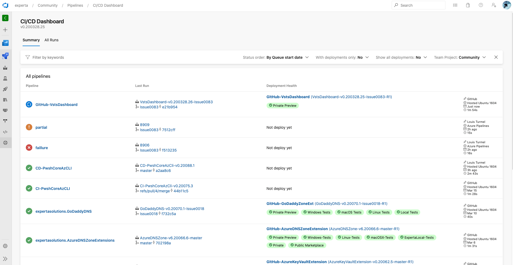

# CI/CD dashboard

## Objectives

Provide a simple way to view all Builds and Releases on a single page.
The intention was to see what's currently happened into the CI/CD pipeline and provide quick feedback of what's going on.

## Note
The UI of this extension has been develop in occordance of the [Formula Design System](https://developer.microsoft.com/en-ca/azure-devops) provided by microsoft.

# ***Important***
This is a version 0.y.z release, which means it's in early stage of features inclusion and optimization.
You can fellow the next features inclusion on our [GitHub project page](https://github.com/expertasolutions/VstsDashboard/issues). If you want to contribute, don't hesitate du jump in it.
