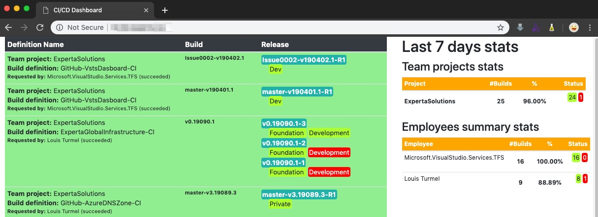

# CI/CD dashboard

## Objectives

Provide a simple way to view all Builds and Releases on a single page.
The intend was to see what's currently happened into the CI/CD pipeline and provide quick feedback of what's going on.

## Current UI


## Local setup from the code
1) Create a file named 'vsts.appsettings.json' into the folder 'Configs/Docker'.
    This file will not get push into git (see .gitignore file)
2) Copy the content of the file 'vsts.appsettings.template.json' into your file 'vsts.appsettings.json'
3) Put your AzureDevOps value into these properties
    - TfsUrl: Tfs Url of your Tfs or Azure DevOps source control
        - AzureDevOps -> (https://dev.azure.com/{your_organization_name}/)
        - Tfs On Premise -> (http|https://{your_tfs_server}:8080/tfs/DefaultCollection)
    - PAT: Personal Access Token from your AzureDevOps (just give access to read to build and release scope)
    - ApiVersion: Set the API-version for builds, releases and projects TFS Rest API
      To find the specifics ApiVersion required, please take a look on the [Azure DevOps Services REST API Reference](https://docs.microsoft.com/en-us/rest/api/azure/devops/?view=azure-devops-rest-5.0) to find which apply to your TFS.

## Example of 'vsts.appsettings.json' file content
### For Azure DevOps
```json
{
  "env": {
    "name":"prod"
  },
  "TfsAccessInfo": {
    "TfsUrl":"https://dev.azure.com/__yourOrg__/",
    "pat":"__yourPAT__",
    "apiVersion": {
      "projects": "5.1-preview.3",
      "builds": "5.1-preview.2",
      "releases": "5.1-preview.5",
      "resourceAreas": "5.0-preview.1"
    }
  }
}
```
### For Azure DevOps Server
```json
{
  "env": {
    "name":"prod"
  },
  "TfsAccessInfo": {
    "TfsUrl": "https://{YOUR_TFS_IP}:8080/tfs/defaultCollection/",
    "pat": "__yourPAT__",
    "apiVersion": {
      "projects": "4.1",
      "builds":"4.1",
      "releases":"4.1-preview.2",
      "resourceAreas":"0"
    }
  }
}
```

## Build it from command line or vscode terminal
1) With the command line or vscode terminal, go into 'Builds' folder
2) Type this command 'docker-compose build && docker-compose up --force-recreate' and wait
3) Open a web browser on 'http://localhost:3000' and 'ta-da' !!!

## Current status
[](https://dev.azure.com/experta/ExpertaSolutions/_build/latest?definitionId=204)

## Next: 
- Build and Release instruction for Kubernetes cluster
- docker-compose.yaml with docker hub container image reference
