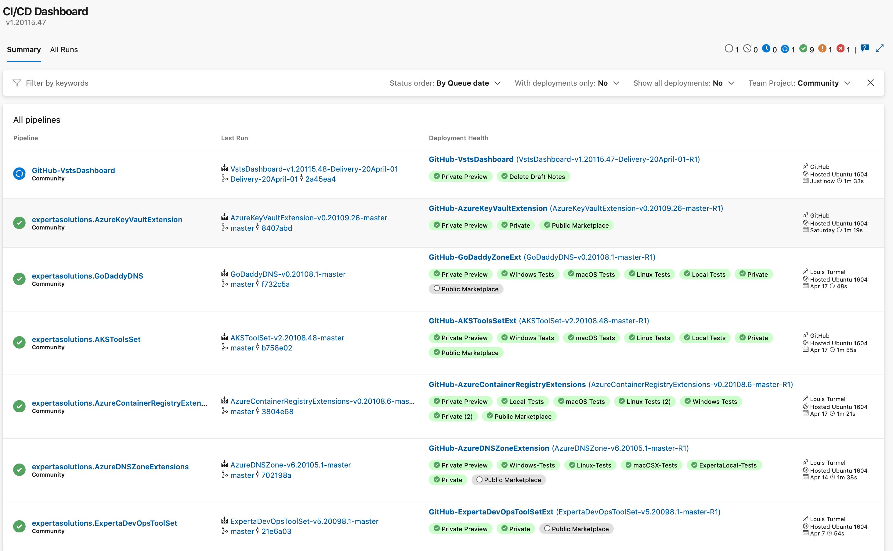

# CI/CD dashboard

Provide a simple way to view all Builds and Releases on a single page.
The intention was to see what's currently happened into the CI/CD pipeline and provide quick feedback of what's going on.

### See [Release notes](https://github.com/expertasolutions/ExpertaDevOpsToolSet/releases)

### **Note**
The UI of this extension has been develop in occordance of the [Formula Design System](https://developer.microsoft.com/en-ca/azure-devops) provided by microsoft.

## **Important**
You can follow the next features inclusion on our [GitHub project page](https://github.com/expertasolutions/VstsDashboard/issues). If you want to contribute, don't hesitate to jump in it.
